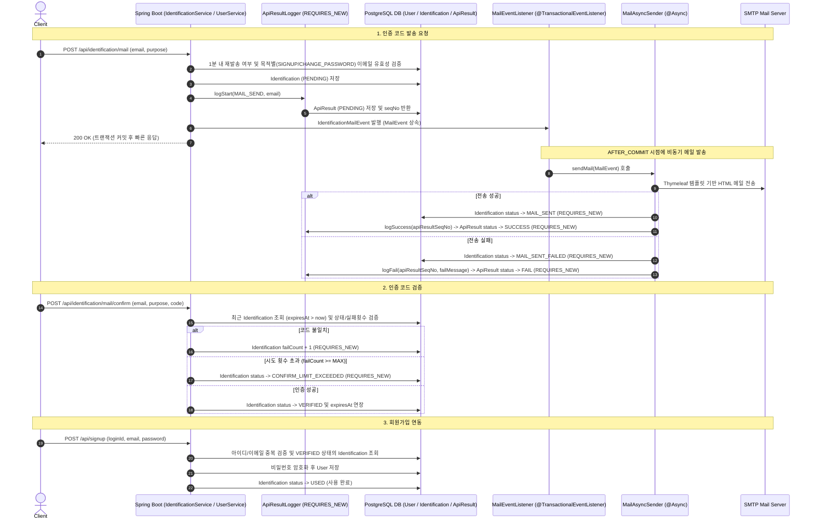

# 🧠 What's in My Brain (WIMB)

> 개발자들이 코드 스니펫, 개발 일지, 기술 노트 등을 손쉽게 기록하고 관리할 수 있는 개인 지식 관리 플랫폼입니다.

---

## 📌 기술 스택

### 백엔드

- **Language:** Kotlin
- **Framework:** Spring Boot 4.x
- **Database / Mapper:** PostgreSQL / MyBatis Mapper
- **Libraries:** JavaMailSender, Thymeleaf, Spring Security

### 프론트엔드

- **Framework/Tool:** Lovable (Generative AI Frontend Builder)
    - TanStack Start 기반의 React 19 + TypeScript + Tailwind CSS v4

---

## 📅 개발 일정

- `2026-09-23` 회원가입, 로그인, 로그아웃 기능 구현
- `2026-09-24` 카테고리 기능 구현
- `2026-09-25 ~ 2026-09-26` 이메일 본인인증 시스템 구축 (이벤트 기반 비동기 전송, 이력/상태 이원화 관리)

> *기능 개발 진행 상황에 따라 순차적으로 업데이트될 예정입니다.*

---

## 🛠️ 주요 기능

### 1. 트랜잭션 커밋 기반 비동기 이메일 본인인증 및 범용 메일 전송 시스템

메일 발송 요청 트랜잭션과 실제 외부 SMTP 발송 로직을 **Spring Event(`ApplicationEventPublisher`)** 및 **`@TransactionalEventListener(AFTER_COMMIT)`**으로 완전히 분리하여, **메인 DB 트랜잭션이 성공적으로 커밋된 직후에만 비동기 메일 전송이 실행**되도록 안전하게 설계했습니다. 또한 `MailEvent` Sealed Class 기반의 **범용 비동기 메일 전송 아키텍처(`MailAsyncSender`)**를 구축하여 본인인증 외 향후 다양한 메일 서비스 확장성을 확보했습니다.

#### 🔄 인증 및 상태 변화 흐름 (Sequence Diagram)

#### 💡 설계 핵심 및 고민했던 포인트

- **`MailEvent` 계층화 및 범용 `MailAsyncSender` 구조 구축:**
  - `MailEvent` Sealed Class를 도입하여 본인인증(`IdentificationMailEvent`)뿐만 아니라 향후 추가될 다양한 메일 이벤트를 하나의 비동기 컴포넌트(`MailAsyncSender`)에서 템플릿/제목/로그를 동적으로 매핑하여 발송할 수 있도록 확장성을 극대화했습니다.
- **외부 API 이력 로거(`ApiResultLogger`) 독립 모듈화:**
  - `ApiResult` 이력 처리를 `ApiResultLogger` 서비스로 분리하고 `Propagation.REQUIRES_NEW` 트랜잭션을 적용하여 메인 비즈니스 로직과 상관없이 독립적인 로깅 lifecycle(PENDING ➔ SUCCESS / FAIL)을 보장했습니다.
- **도메인 상태(`IdentificationStatus`) 세분화 및 재사용 방지:**
  - 본인인증 생애주기를 `PENDING` ➔ `MAIL_SENT` ➔ `VERIFIED` ➔ `USED`로 명확히 정의하여 회원가입 완료 시 최종 `USED` 상태로 변경함으로써 인증 코드 재사용 공격을 완벽히 차단했습니다.
  - 예외 상태를 `MAIL_SENT_FAILED`(메일전송실패) 및 `CONFIRM_LIMIT_EXCEEDED`(인증검증횟수초과)로 정교하게 구분하여 상태 모니터링을 강화했습니다.
- **`@TransactionalEventListener(AFTER_COMMIT)` 기반 비동기 처리:**
  - 메인 비즈니스 로직(DB 저장)이 100% 커밋된 후에만 외부 메일 전송 이벤트가 실행되도록 보장하여 DB 저장 실패 시 불필요한 메일이 전송되는 사이드 이펙트를 차단했습니다.
- **목적별(`purpose`) 이메일 유효성 검증 및 보안 제약:**
  - **목적별 검증:** `SIGNUP`/`CHANGE_EMAIL` 시 기존 등록 이메일 중복 차단, `CHANGE_PASSWORD` 시 존재하지 않는 이메일 차단
  - **1분 재발송 제한:** 동일 이메일 대상 1분 이내 메일 재요청을 DB 기반으로 차단
  - **시도 횟수 제한:** 인증 코드 입력 실패 횟수(`failCount`)가 최대 제한을 초과할 경우 해당 인증 건을 즉시 `CONFIRM_LIMIT_EXCEEDED` 상태로 전환 및 차단

---

## 📡 API Specification

현재 구현 완료 및 설계된 백엔드 API 명세입니다.

<b>🔒 Auth API (인증)</b>

- `POST /api/signup` : 회원가입
    - Request: `loginId`, `email`, `password`
- `POST /api/login` : 로그인
    - Request: `loginId`, `password`
- `POST /api/logout` : 로그아웃
- `GET /api/me` : 로그인 직후 사용자 정보 조회
    - Response: `userId`, `loginId`, `email`, `role`, `imageUrl`

<b>📧 Identification API (본인인증)</b>

- `POST /api/identification/mail` : 인증코드 발송 (메일 전송)
    - Request: `email`, `purpose` (`SIGNUP` | `CHANGE_EMAIL` | `CHANGE_PASSWORD`)
- `POST /api/identification/mail/confirm` : 인증코드 확인
    - Request: `email`, `purpose` (`SIGNUP` | `CHANGE_EMAIL` | `CHANGE_PASSWORD`), `code`

<b>📂 Category API (카테고리 관리)</b>

- `POST /api/categories` : 카테고리 저장
    - Request: `name`
- `GET /api/categories` : 카테고리 목록 조회
    - Response: `postCategoryId`, `name`, `sortOrder`, `postCount`
- `PATCH /api/categories/{categoryId}/name` : 카테고리명 수정
    - Request: `newName`
- `PATCH /api/categories/order` : 카테고리 순서 변경
    - Request: `orderedIds` (`List<Long>`)
- `DELETE /api/categories/{categoryId}` : 카테고리 삭제

---

## 🗄️ ERD

*준비 중입니다.*

---

## 💻 Getting Started

*준비 중입니다.*